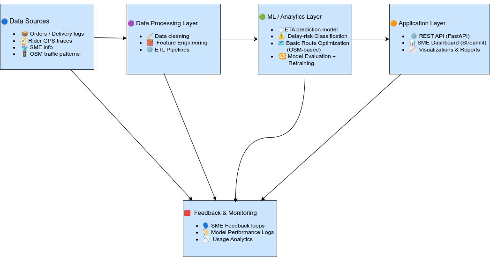

# 📦 Data-Driven Last-Mile Delivery Optimization for E-Commerce SMEs in Nigeria

## 📘 Project Overview

E-commerce in Nigeria is growing rapidly, but small and medium-sized enterprises (SMEs) still
face major challenges with last-mile delivery. Platforms like **Chowdeck, Bolt Food,** and **Uber Eats**
help businesses fulfill orders, yet **traffic delays, rider shortages, unpredictable demand, and**
**inefficient dispatching** continue to cause long delivery times — especially for SMEs that lack
data-driven tools.

This project builds a **machine learning–powered system** that analyzes delivery patterns, predicts
delays, estimates delivery time (ETA), and recommends smarter dispatching decisions. The goal is
to give SMEs **the same data intelligence used by large logistics companies**, but in a simple,
lightweight, and affordable form.

---

## 🎯 Objectives

1. **Collect and engineer delivery data**

   (orders, locations, timestamps, rider assignments).

2. **Perform exploratory data analysis (EDA)**

   to uncover delivery delays, traffic hotspots, and demand patterns.

3. **Build predictive machine learning models** to:

    - estimate delivery time (ETA)

    - classify orders at risk of delays

    - recommend optimal rider assignments

4. **Evaluate model performance** and measure how predictions can reduce delivery inefficiencies,
    using Mean Absolute Error(MAE), Root Mean Square Error (RMSE), accuracy and confusion matrices.

5. **Provide actionable insights for SMEs** relying on third-party delivery platforms.

🌍**Why This Project Matters**

- Most SMEs do not collect or analyze delivery data, so they cannot detect inefficiencies.
- Unpredictable rider availability and heavy traffic cause long delays and cancellations.
- A lightweight ML system helps SMEs:
  - reduce delivery times
  - improve customer satisfaction
  - minimize cancelled orders
  - anticipate rider delays
  - plan for peak demand.
  - track performance over time
  
This project empowers SMEs to make data-driven decisions while continuing to use existing platforms
like Chowdeck, Bolt Food, Uber Eats, and Jumia Food.

## 🗂️ Data Source

Because real delivery data is not publicly available, this project
uses synthetic but realistic datasets based on:

    - order timestamps
    - customer GPS coordinates
    - rider movement patterns
    - platform-based delivery flows
    - traffic behaviours and congestion points.
  
  Data is generated using:
  
    - Python, pandas,Numpy
    - Faker library
    - OpenStreetMap (OSM) for geospatial mapping
    - custom simulation logic for rider behaviour and traffic

## 🔧 Methodology

1. **Data Engineering & Preprocessing**
   - Clean raw logs
   - Validate missing timestamps and GPS values
   - Map GPS coordinates using OpenStreetMap(OSM)
   - Feature engineering::
     - trip distance
     - time of day
     - demand clusters
     - weather (optional)
     - platform-type
     - rider availability
  
2. **Exploratory Data Analysis**
   - Heatmaps of delivery hotspots
   - Distribution of delivery delays
   - Rider availability patterns
   - Comparison of order peaks across SMEs

3. **Predictive Modelling**

   Models used include:
   - Linear Regression (baseline)
   - Random Forest Regressor
   - Gradient Boosting / XGBoost

  Tasks:

     - Predict estimated delivery time (ETA)
     - Classify orders at risk of high delay
     - Recommend efficient rider assignments

1. Model Evaluation

   - Mean Absolute Error (MAE) / Root Mean Square Error (RMSE)
   - Accuracy for delay-risk prediction
   - Confusion matrix
   - Baseline vs improved model comparison

## 📌 Expected Outcomes

- A clean, reproducible ML pipeline for SME logistics
- Accurate ETA predictions
- Delay-risk classification models
- Geospatial delivery visualizations
- A dashboard SMEs can use to monitor delivery performance
- Data-driven recommendations for dispatching and planning
  
## 🛠️ Technologies used

- Python
- Pandas/NumPy
- Scikit-learn
- GeoPandas
- Matplotlib / Folium / Plotly
- OpenStreetMap APIs
- Git / GitHub
- Streamlit (for dashboard demo)
  
## 👥 Who This Project Helps  

- Restaurants
- Online sellers
- Grocery stores
- SMEs operating on platforms like Chowdeck, BoltFood, Uber Eats, Glovo, Jumia Food
- Logistics startups serving e-commerce vendors

This system does not compete with these platforms — it empowers SMEs with analytics and
insights to improve their delivery outcomes.

## Motivation

This project is inspired by my experience founding Tomori Foods, a food business I ran
during my undergraduate years. Logistics was our biggest challenge — we dealt with rider
shortages, traffic delays, and customer complaints.

I always wished for a simple system that could:

    - predict delays
    - assign riders efficiently
    - plan routes automatically
    - show a clear overview of delivery performance

This project recreates those challenges through synthetic data and demonstrates how AI
and data-driven tools can transform small-scale logistics in Nigeria.

## 🧩 Features

- **Route Optimization:**
  
  Suggests shorter or faster delivery paths.

- **Traffic Simulation:**
  
  Generates and updates realistic traffic data.

- **Dynamic Re-Routing:**
  
  Automatically recommends new routes when delays occur.

- **Analytics Dashboard:**
  
  Visualizes delivery times, demand zones, and delay trends.  

---

## System Architecture

Below is the high-level architecture of the platform:

## Data Architecture

## Competitor Analysis

Platforms like **Chowdeck** and **Bolt Food** excel at:

    - High delivery volume

    - 30-minute fulfillment

    - Vendor integrations

    - Dark-store efficiency

### How This Project Differs

    - ML-driven delay prediction

    - Real-time route optimization

    - Demand forecasting for rider allocation

    - Modular, affordable tools for SMEs

    - Insights without needing an in-house data team

 This project is not a delivery service — it is a data-driven optimization engine for SMEs.

 ---

## 🏁 Conclusion

This project shows how SMEs in Nigeria can leverage data-driven intelligence to improve delivery
operations without owning a logistics fleet. By combining synthetic datasets, geospatial mapping,
predictive modelling, and route optimization, the system provides practical tools for forecasting
delivery times, identifying risks, and improving dispatching efficiency.

Future enhancements will include real-time API integration, automated re-routing, cloud deployment,
and live dashboards for SME operators.

## 🙏 Acknowledgments

Special thanks to my colleagues from Tomori Foods — Fola and Harun — whose teamwork and
resilience inspired this project. Their support motivated me to explore innovative ways
to help small businesses through data analytics, AI, and automation.
